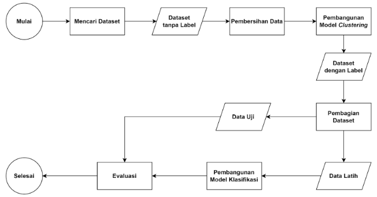

# Membangun Proyek Machine Learning

Submission ini mencakup dua tahap utama, yaitu Clustering dan Klasifikasi, dengan kriteria serta urutan kerja sebagai berikut.

## Panduan Dataset

- Sumber Dataset

    1. Bebas, peserta dapat menggunakan data dari berbagai sumber, baik primer maupun sekunder.

        - Data primer: Data yang dikumpulkan secara mandiri oleh peserta, misalnya melalui survei, wawancara, atau pengamatan langsung.

        - Data sekunder: Data yang diambil dari sumber yang sudah ada, seperti public repository (misalnya Kaggle, UCI Machine Learning Repository, atau situs open data lainnya). Anda dianjurkan untuk mengeksplorasi dataset yang beragam guna memperkaya analisis.

- Tema Dataset

    1. Tema bebas: Anda dapat memilih topik atau tema dataset yang sesuai dengan minat. Beberapa contoh tema yang dapat digunakan termasuk:

        - Data keuangan (misalnya: harga saham, laporan penjualan),
        
        - Data kesehatan (misalnya: data pasien, hasil diagnosis),
        
        - Data pendidikan (misalnya: prestasi akademik, survei mahasiswa), dan
        
        - Data sosial (misalnya: survei kepuasan pelanggan, data demografi).

    2. Fleksibilitas dalam memilih tema ini dimaksudkan untuk memberi ruang kreativitas dan memberikan kesempatan bagi Anda agar lebih mendalami analisis pada bidang yang diminati.

- Ketentuan Teknis Dataset

    1. Dataset Awal Tidak Memiliki Label atau Kelas

        Dataset yang digunakan tidak memiliki label atau kelas sehingga dapat digunakan untuk tahapan unsupervised learning.

    2. Jumlah Baris Minimal

        Dataset yang dipilih harus memiliki minimal 1000 baris. Jumlah ini penting dalam memastikan bahwa dataset memiliki cukup banyak data untuk dilakukan analisis bermakna sehingga hasil model machine learning yang dibangun dapat diuji secara akurat dan menghasilkan wawasan lebih general.

3. Jumlah kolom

    Minimal memiliki dua kolom yang digunakan untuk modelling, mohon pastikan dataset tersebut mengandung data kategorikal atau data numerikal.

    - Data Kategorikal: Variabel atau fitur yang terdiri dari kategori atau kelompok tertentu.
    
        Contoh: jenis kelamin (laki-laki/perempuan), kategori produk (elektronik, pakaian, makanan).

    - Data Numerikal: Nilai-nilai angka yang dapat diukur dan dianalisis.
    
        Contoh: usia, pendapatan, harga produk, atau jumlah unit yang terjual.

4. Pembatasan Dataset yang Digunakan

    Untuk menjaga keragaman analisis dan menghindari repetisi, dataset yang digunakan dalam latihan clustering (customer segmentation) tidak boleh digunakan. Ini akan membantu Anda mengeksplorasi dan memahami beragam dataset baru serta mengembangkan kemampuan analisis yang lebih luas.

## Kriteria

1. Menggunakan Templat Notebook yang Disediakan

    Anda harus mengikuti templat yang telah disediakan untuk proses pengerjaan submission ini. Pastikan setiap langkah dalam templat dilaksanakan secara sistematis dan sesuai dengan instruksi yang diberikan.

    Template Clustering: [[Clustering] Submission Akhir BMLP_Your Name.ipynb](https://colab.research.google.com/drive/1nMUrWBXfiryRQU4Wu34N0B0OLm4qxJYS?usp=sharing)

    Template Klasifikasi:  [[Klasifikasi] Submission Akhir BMLP_Your Name.ipynb](https://colab.research.google.com/drive/1dygqHl-RYE0PmGXP74G__HNnnpjzoOT4?usp=sharing)

Kriteria untuk Proyek Clustering

2. Pemilihan Kolom Dataset

    - Dataset yang digunakan dalam pembuatan model **minimal dua kolom** dan **1000 baris data**.
    - Ketentuan Teknis Dataset
        - Dataset Awal Tidak Memiliki Label atau Kelas
        
            Dataset yang digunakan tidak memiliki label atau kelas sehingga dapat digunakan untuk tahapan unsupervised learning.

        - Tema Dataset
            - Tema bebas: Anda dapat memilih topik atau tema dataset yang sesuai dengan minat.
            
                Beberapa contoh tema yang dapat digunakan termasuk berikut ini.

                - Data berita dunia (misalnya: kesejahteraan, kejahatan)
                
                    [Dataset Kesejahteraan Pekerja Indonesia](https://www.kaggle.com/datasets/wowevan/dataset-kesejahteraan-pekerja-indonesia?select=garisKemiskinan.csv)
                
                - Data makanan dan minuman (misalnya: data jenis makanan, penjualan F&B)

                    [Beverage Sales](https://www.kaggle.com/datasets/sebastianwillmann/beverage-sales)
                
                - Data lainnya

                    [Bank Transaction Dataset for Fraud Detection](https://www.kaggle.com/datasets/valakhorasani/bank-transaction-dataset-for-fraud-detection)

        - Namun tidak terbatas pada dataset di atas, Anda juga dapat melakukan eksplorasi secara mandiri untuk menentukan dataset yang akan digunakan. Sebagai catatan, pastikan dataset yang digunakan **tidak mirip dengan dataset latihan customer segementation**.

3. Evaluasi Akhir pada model Clustering.

    Pastikan Anda melakukan evaluasi terhadap jumlah clustering yang digunakan menggunakan silhoutte score.

4. Menuliskan Interpretasi Cluster.

    Setelah melakukan clustering, Anda harus membuat interpretasi cluster. Deskripsikan karakteristik utama dari setiap cluster yang terbentuk dan temukan pola-pola penting pada data tersebut. Interpretasi harus mencakup hal berikut: 

    1. Inversi data fitur dan target ke versi asli
    2. Melakukan agregasi pada fitur yang sudah diinversi berdasarkan klaster yang sudah didapat.
    
        Fungsi agregasi yang disarankan sebagai berikut.
        1. min, max, mean untuk fitur bertipe numerik.
        2. Modus untuk fitur bertipe kategorikal.
        3. Diperbolehkan menggunakan metode lainnya yang tidak disebutkan di atas.
    3. Tulis analisis hasil agregasi tersebut. Format yang disarankan

        Format:
        1. Klaster 1 didapatkan karena Variabel 1 memiliki nilai rata-rata x dengan batas minimum y dan batas maksimum z , dan Variabel 2 memiliki nilai modus kategori a.
        2. Klaster 2 …
        3. Dan seterusnya

    Keterangan:
    - Klaster 1: Variabel target yang nilainya ingin dijelaskan.
    - Variabel 1: Variabel independen pertama bertipe numerik yang memengaruhi hasil (misalnya, kualitas produk).
        - Nilai rata-rata x: Rata-rata statistik dari variabel tersebut.
        - Batas minimum y: nilai minimum dari variabel tersebut
        - Batas maximum z: nilai maksimum dari variabel tersebut
    - Variabel 2: Variabel independen kedua bertipe kategorikal yang memengaruhi hasil (misalnya, pelayanan).
        - Nilai modus kategori a: Kategori yang paling sering muncul (modus) untuk variabel tersebut.
    - Analisis: Berisikan kesimpulan klaster yang dibuat.

    Adapun langkah-langkah untuk melakukan inverse data sebagai berikut:

    - Masukan hasil label dari cluster ke kolom baru pada dataframe yang telah dilakukan normalisasi.
    - Lakukan Inverse Transform pada feature yang sudah dilakukan Labelisasi dan Standararisasi. Berikut code untuk melakukannya:
    - label_encoder.inverse_transform(X_Selected[['Fitur']])    
    - Lalu masukan ke dalam kolom dataset asli atau membuat dataframe yang baru
    - Setelah itu carilah nilai mean dari kolom numerikal dan nilai modus pada kolom kategorikal pada masing-masing cluster.
    - Penjelasan mengenai distribusi data dalam setiap cluster.
    - Wawasan yang dapat diambil dari hasil clustering dan insight yang relevan untuk analisis lanjut.

Kriteria untuk Proyek Klasifikasi

5. Menggunakan Dataset dan Label dari Hasil Clustering

    Untuk tahap klasifikasi, Anda wajib menggunakan dataset yang sudah diberi label berdasarkan hasil clustering. Label tersebut akan menjadi target/kelas dalam proses klasifikasi.

6. Menampilkan Akurasi dan F1-Score pada Training dan Testing Set.

    Model klasifikasi yang Anda bangun mendapatkan akurasi dan F1-Score pada training set serta testing set. Hal ini memastikan model yang Anda bangun memiliki nilai parameter evaluasi pada data Training dan Testing set.

## Penilaian

Submission Anda akan dinilai oleh reviewer dengan skala 1–5 berdasarkan dari parameter yang ada. Anda dapat menerapkan beberapa saran untuk mendapatkan nilai tinggi. Berikut sarannya.

1. Menggunakan dataset dengan **minimal 2500 baris**.
2. Menggunakan **minimal 5 fitur** untuk proses clustering dengan **campuran numerikal dan kategorikal**.
3. **Menerapkan feature selection** pada tahap clustering untuk memilih fitur terbaik dan membandingkan silhoutte score dengan sebelum menggunakan feature selection.
4. Evaluasi akhir pada clustering harus mencapai **nilai silhouette score minimal 0.70**.
5. Mengimplementasikan **2 algoritma klasifikasi** yang berbeda untuk membandingkan performa model.
6. Meningkatkan **akurasi dan F1-Score** pada **training serta testing** set **minimal 92%**.

Berikut adalah detail penilaian submission:

&starf;&star;&star;&star;&star; : Semua kriteria utama terpenuhi, tetapi penulisan kode masih perlu banyak diperbaiki atau terindikasi melakukan plagiat.

&starf;&starf;&star;&star;&star; : Semua kriteria utama terpenuhi, tetapi penulisan kode masih perlu diperbaiki.

&starf;&starf;&starf;&star;&star; : Semua kriteria utama terpenuhi, tetapi tidak terdapat saran yang terpenuhi.

&starf;&starf;&starf;&starf;&star; : Semua kriteria utama terpenuhi dan menerapkan minimal 3 dari seluruh saran yang ada di atas.

&starf;&starf;&starf;&starf;&starf; : Semua kriteria utama terpenuhi dan menerapkan semua saran yang ada di atas.

## Submission yang Tidak Sesuai Kriteria

- **Tidak melampirkan file** yang diminta pada ketentuan berkas submission.
- **Tidak menggunakan template** yang disediakan.
- **Memasukan kolom ID** untuk dimasukan ke dalam data training.
- Tidak menampilkan/memiliki nilai **silhouette score**.
- **Tidak memberikan penjelasan** mengenai hasil clustering.
- Tidak menggunakan **dataset dan label dari hasil clustering**.
- Model klasifikasi **tidak menampilkan akurasi dan F1-Score pada training set serta testing set**.
- Tidak diperbolehkan menggunakan platform atau metode **AutoML**, seperti berikut.
    - PyCaret
    - Auto-sklearn
    - Google Cloud AutoML 
    - H2O Driverless AI (dari H2O.ai)
    - Microsoft Azure Automated Machine Learning
    - TPOT (Tree-based Pipeline Optimization Tool)
    - DataRobot
    - RapidMiner Auto Model
    - Amazon SageMaker Autopilot
    - IBM Watson AutoAI